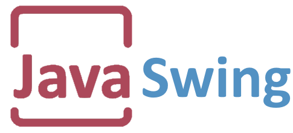

### Sobre mim

- Eu me chamo miguel, e estou cursando Desenvolvimento de Sistemas no Cotil - Unicamp
- As minhas linguagens favoritas são Java e C, e eu sou um viciado em linux. [Arch Linux](https://archlinux.org) + [Hyprland](https://hyprland.org)
- Atualmente eu estou aprendendo desenvolvimento web fullstack e machine learning.

### Tecnologias

<html>
  <h2 align="center">Tenho domínio em</h2>
  

      
      
      
       
      
      
      
      
      
    

  <h2 align="center">Estou aprendendo...</h2>
    

      
      
       
      
      
      
    

</html>
