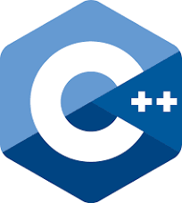

### About me

- I'm Miguel, a brazillian developer, and am currently studying at Cotil - Unicamp.
- My favourite languages are Java and C, and I am a linux addict. [Arch Linux](https://archlinux.org) + [Hyprland](https://hyprland.org)

### Stuff I know 

<html>
  <h2 align="center">Ask me about</h2>
  

    
    
  

  <h2 align="center">Things I have a solid foundation on</h2>
    

      
      
    

  <h2 align="center">Things I know the basics about</h2>
    

      
      
      
      
      
    

  <h2 align="center">Things I'm still learning</h2>
    

      
      
      
    

  <h2 align="center">Things I want to learn</h2>
    

        
      

</html>
