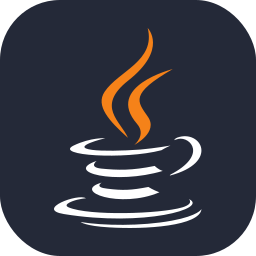

<h2 align="left">❓ About me</h2>

- I'm a 16 year old computer science student, currently enrolled at a system development course at [Cotil](https://www.cotil.unicamp.br) - [Unicamp](https://www.unicamp.br)
- My favourite language is C, and I am a linux addict. I use [openSUSE Tumbleweed](https://www.opensuse.org) + [Hyprland](https://hyprland.org) btw!
- Currently, I'm learning backend development and the sockets API in C with libmicrohttpd and [mongoose (an embedded webserver)](https://github.com/cesanta/mongoose).

<h2 align="left">💻 Projects</h2>
<small><h5>Labels</h5>
    <small>
        d - in development &nbsp;|&nbsp; s - stable &nbsp;|&nbsp; f - finished
    </small>
</small>
 
 

- [d] [Opensync](https://opensync-web.netlify.app): A streamlined, lightweight and open-source file backup platform, written in C with mongoose and SQLite
- [d] [JurAI](https://github.com/jurai-git): An AI-powered Jurisprudence assistant, designed to help lawyers manage legal research, client interactions, and requests

<h2 align="left">:hammer: Tools</h2>
 

    
    
    
    
    
    
    
    
     
    
    
    
    
    

 
<h2 align="left">:fire: Stats</h2>
 
<html align="center">
  

  
  

</html>

